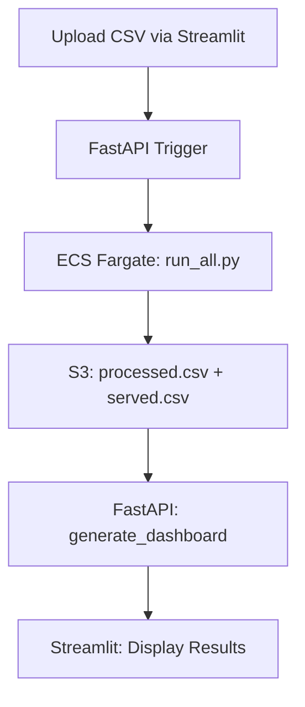

Certainly! Below is your complete `README.md` with the **step-by-step textual pipeline flowchart** seamlessly added **after the Visual Overview** section. This preserves your existing structure and enhances clarity by detailing the entire pipeline lifecycle.

---

```markdown
# 🧠 AWS Sentiment Analysis Pipeline

This repository implements an end-to-end sentiment analysis pipeline using AWS services with fully automated CI/CD using GitHub Actions. It handles data ingestion, preprocessing, model training, evaluation, and deployment with a web-based user interface.

---

## 📁 Project Structure

```

sentiment-app/
├── backend/                # FastAPI backend APIs
│   ├── main.py             # Entry point for FastAPI
│   ├── routes/             # API endpoints
│   └── utils/              # Utility functions
├── frontend/               # Streamlit user interface
│   └── streamlit\_app.py    # Frontend application
├── sentiment-pipeline/     # PySpark + BERT inference logic
│   ├── run\_clean.py        # Preprocessing
│   ├── run\_infer.py        # Inference
│   └── run\_all.py          # Combined pipeline for ECS
├── Dockerfile              # Containerization for Spark + Transformers
├── requirements.txt        # Unified Python dependencies
└── .github/workflows/      # GitHub Actions CI/CD workflows

````

---

## 🔄 Data Pipeline (AWS Glue)

| Step              | Script                  | Input                             | Output                                  |
| ----------------- | ----------------------- | --------------------------------- | --------------------------------------- |
| Preprocessing     | `data_preprocessing.py` | `Bronze/train.parquet`            | `Bronze/pre_processed.parquet`          |
| Schema Validation | `schema_validation.py`  | `Bronze/pre_processed.parquet`    | `Bronze/schema_validated.parquet`       |
| Anomaly Detection | `anomaly_detection.py`  | `Bronze/schema_validated.parquet` | `Bronze/anomaly_flagged.parquet`        |
| Sampling          | `sampling.py`           | `Bronze/anomaly_flagged.parquet`  | `Silver/sampled.csv`, `Silver/test.csv` |

**Orchestrated via**: AWS Glue Workflows

---

## 🤗 Model Training & Evaluation (SageMaker)

* **Model**: DistilBERT  
* **Training**: AWS SageMaker (`Silver/sampled.csv`)  
* **Evaluation**: Local using Hugging Face `Trainer.evaluate()` on `Silver/test.csv`

**Metrics**:
- Accuracy: 93.14%
- Precision: 94.34%
- Recall: 91.78%
- F1 Score: 93.05%

**Artifacts**:  
`s3://mlops-sentiment-analysis-data/models/model.tar.gz`

---

## 🚀 Deployment

### 🖥️ Backend (FastAPI)

* `/login` - AWS Cognito  
* `/trigger_pipeline` - Launch ECS job  
* `/generate_dashboard` - Generate dashboard  

### 🌐 Frontend (Streamlit)

* Upload CSV → Trigger pipeline → View dashboard  
* Polls ECS job status in real-time  

### 🐳 ECS Fargate Execution

* `run_all.py`: Executes preprocessing and inference using Spark and Transformers  
* Output saved to S3:  
  - `processed/{user}/processed.csv`  
  - `output/{user}/served.csv`  

---

## 🔁 CI/CD (GitHub Actions)

### ✅ Continuous Integration (CI)

* Run on every push  
* Installs dependencies  
* Executes unit tests with `pytest`  

### 🚀 Continuous Deployment (CD)

* Builds Docker image  
* Pushes to AWS ECR  
* Deploys updated image to ECS task  
* Triggers SageMaker training and logs output to MLflow  

---

## 🔐 Environment Setup

* `.env` file includes credentials for Cognito, ECS, and S3  
* Transferred securely via SCP to EC2 instance  

```bash
scp -i "key.pem" .env ec2-user@<ec2-ip>:/home/ec2-user/sentiment-app/backend/
````

---

## 📊 Visual Overview

### 🔸 Data + Model + Deployment Pipeline



---

## 🧩 End-to-End Pipeline Overview

This project consists of four major stages: **Data Pipeline (Glue)**, **Model Training (SageMaker)**, **Application Inference (ECS + UI)**, and **CI/CD Automation (GitHub Actions)**.

---

### 🔁 1. Data Pipeline — *AWS Glue + S3*

Orchestrated by AWS Glue Workflows.

```
┌───────────────────────────────────────┐
│         AWS Glue Workflow            │
│  ├─ data_preprocessing.py            │
│  │   - Drop nulls, clean text        │
│  ├─ schema_validation.py             │
│  │   - Validate text/rating          │
│  ├─ anomaly_detection.py             │
│  │   - Flag short/long reviews       │
│  └─ sampling.py                      │
│      - Remove neutral, stratify      │
└────────────┬──────────────────────────┘
             ▼
┌──────────────────────────────────────────────┐
│                Amazon S3                     │
│ ├─ raw/                  ← raw reviews.csv    │
│ ├─ Bronze/               ← cleaned .parquet   │
│ ├─ Silver/               ← sampled.csv, test  │
│ └─ metadata/             ← class dist, length │
└──────────────────────────────────────────────┘
```

---

### 🧠 2. Model Training — *Amazon SageMaker + Hugging Face*

Fine-tune DistilBERT on preprocessed and labeled data.

```
┌──────────────────────────────────────────────┐
│           Amazon SageMaker Training          │
│  - Input: Silver/sampled.csv                 │
│  - Model: DistilBERT (transformers)          │
│  - Output: model.tar.gz → S3/models/         │
└──────────────────────────────────────────────┘
             ▼
┌──────────────────────────────────────────────┐
│       Evaluation (local or CI/CD)            │
│  - Input: Silver/test.csv                    │
│  - Logs: Accuracy, Precision, Recall, F1     │
│  - Save: tested.csv + model_evaluation.json  │
└──────────────────────────────────────────────┘
```

---

### 💻 3. Application Inference — *User + ECS + FastAPI + Streamlit*

Triggered directly by the user via the Streamlit frontend.

```
┌────────────────────────────────────┐
│            User (via UI)          │
│ Uploads CSV to Streamlit App      │
└────────────┬──────────────────────┘
             ▼
┌────────────────────────────────────┐
│        Streamlit Frontend         │
│ - Upload CSV                      │
│ - Triggers FastAPI endpoint       │
└────────────┬──────────────────────┘
             ▼
┌────────────────────────────────────┐
│        FastAPI Backend             │
│ - /trigger_pipeline: ECS run_all   │
│ - /generate_dashboard: summarize   │
└────────────┬──────────────────────┘
             ▼
┌────────────────────────────────────┐
│         ECS Fargate Task           │
│ - run_all.py = run_clean + infer   │
│ - Loads model.tar.gz               │
│ - Writes to output/{user}/served.csv │
│ - Updates inference_summary.json   │
└────────────┬──────────────────────┘
             ▼
┌────────────────────────────────────┐
│     Streamlit shows dashboard      │
│ - Top reviews, sentiment dist.     │
│ - Real-time polling from S3        │
└────────────────────────────────────┘
```

---

### 🔁 4. CI/CD — *GitHub Actions + ECR + ECS + SageMaker*

Fully automated deployment and model training pipeline.

```
┌────────────────────────────────────────┐
│         GitHub Actions CI/CD          │
│ - On push / PR                        │
│   ├─ Install + test (pytest)          │
│   ├─ Build Docker (Spark+BERT image)  │
│   ├─ Push to Amazon ECR               │
│   ├─ Update ECS Task (Fargate)        │
│   └─ Trigger SageMaker Training Job   │
└────────────────────────────────────────┘
```

---

### ✅ Summary Table

| Stage         | Services Used                               |
| ------------- | ------------------------------------------- |
| Data Pipeline | AWS Glue, AWS S3                            |
| Model Train   | Amazon SageMaker, Hugging Face Transformers |
| Inference App | ECS Fargate, FastAPI, Streamlit, S3         |
| CI/CD         | GitHub Actions, Amazon ECR, ECS, SageMaker  |

---

## 📁 S3 Bucket Structure

```
s3://mlops-sentiment-analysis-data/
├── raw/
├── Bronze/
├── Silver/
├── test/
├── output/{user}/served.csv
├── processed/{user}/processed.csv
├── metadata/
```

---

## 📡 Monitoring & Logs

```bash
# Backend logs
$ tail -f fastapi.log

# Frontend logs
$ tail -f streamlit.log
```

---

## 🙌 Credits

Built using: AWS Glue, SageMaker, ECS Fargate, EC2, FastAPI, Streamlit, HuggingFace, PySpark, MLflow

---

> ✨ Fully CI/CD-enabled, cloud-optimized sentiment analysis app ready for production!
